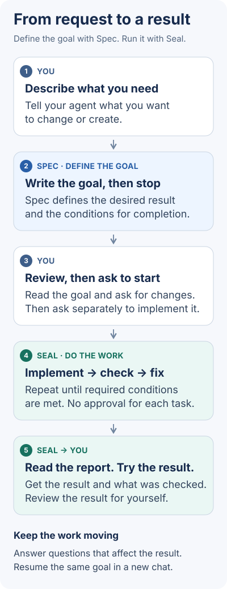
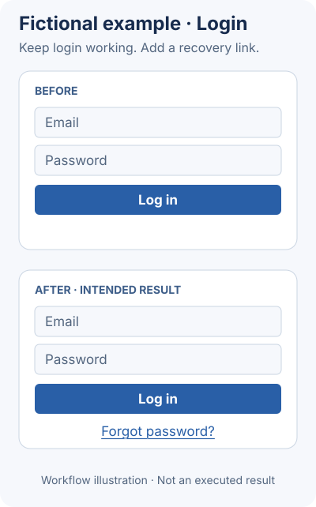

<h1 align="center">Jaekit</h1>

<p align="center"><strong>See what the agent checked before it called your work done.</strong></p>

<p align="center">
  <a href="https://github.com/jgoneit/jaekit/releases"></a>
  <a href="guides/INSTALL.en.md"></a>
  <a href="LICENSE"></a>
</p>

<p align="center"><a href="#install">Install</a> · <a href="#fictional-example">Example</a> · <a href="guides/USAGE.en.md">Usage guide</a><br /><a href="README.md">한국어</a> · <strong>English</strong></p>

Jaekit is a tool for **people working on projects with Codex or Claude Code**. **Spec** turns a request into a goal and conditions for completion. **Seal** guides the agent through implementation, checks, and fixes against that goal. You receive the result and a record of what was verified. If the conversation ends, it can continue from the saved progress.

The current release is **v0.1.2**, an early version being refined through real work.

## How it works



Read the goal Spec wrote and say what needs changing. When it is ready, **send a separate start request** to Seal. You do not approve each task; answer when a decision affects the outcome. If the conversation ends, name the same goal to continue.

Completion means **the required conditions are met through recorded checks and any necessary user confirmations**. The agent writes the automated checks, so this is not a guarantee that the entire result is flawless or independently verified. Review the report and the actual result together ([reading the completion report](guides/USAGE.en.md#reading-the-completion-report)).

## Fictional example

**Example request:** “Add a Forgot password link to the login screen.” Imagine a project that already has a password reset page.

Spec defines the goal: **the new link opens the existing reset page, and login keeps working as before**, then stops. After you review the goal and separately start Seal, the agent adds the link and checks both conditions.



This is a **fictional illustration made to explain the workflow**, not an executed or verified case. In a real task, read the recorded checks for each condition and try the link and login yourself. [About the illustrations and how to edit them](assets/readme/SOURCES.en.md)

## Get started

### Install

These steps use Codex on macOS. You need [Homebrew](https://brew.sh) (a program installer), Git (a tool that tracks file changes), and [Codex CLI](https://learn.chatgpt.com/docs/codex/cli) (Codex's Terminal tool). The project folder you work in must also be managed with Git. Terminal is the app where you type commands to run programs.

For Claude Code, use the [Claude Code installation](guides/INSTALL.en.md#claude-code). For Linux or an install without Homebrew, see the [install guide](guides/INSTALL.en.md). You do not need to copy the Jaekit repository to your computer.

The record tool `ha` (Seal Core) does not support Windows, so Seal cannot run there. Spec does not need `ha`, but installing and running it on Windows has not been checked yet.

1. **In Terminal, install the record tool `ha`.** Run one block at a time and wait for it to finish.

   ```bash
   brew install jgoneit/tap/jaekit
   ```

   When it finishes, check the version.

   ```bash
   ha --version
   ```

   It should print `ha 0.1.2`. If it prints another version or the command is missing, see [Check the version](guides/INSTALL.en.md#check-the-version).

2. **In the same Terminal, install both plugins in Codex.** A plugin adds capabilities to the agent.

   ```bash
   codex plugin marketplace add jgoneit/jaekit@v0.1.2
   codex plugin add spec@jaekit
   codex plugin add seal@jaekit
   ```

   `@v0.1.2` pins the version to use. Reopen Codex after installation. If you already installed Jaekit, first see [Update](guides/INSTALL.en.md#update) or [Move from a local path registration](guides/INSTALL.en.md#move-from-a-local-path-registration).

### Your first task

Open Codex CLI or the desktop app in your project folder. **Type `$` in the agent conversation, choose Jaekit's `spec:spec` from the list**, then write your request. This is not a Terminal command.

```text
$spec:spec Add a "Forgot password" link to the login screen
```

Read the goal document Spec gives you, answer any questions, or say what to change. Then, in a separate message, choose Jaekit's `seal:seal` from the `$` list to start. Replace `<goal>` below with **the goal folder name Spec reported**; it is not text to type literally.

```text
$seal:seal docs/specs/<goal>
```

The [usage guide](guides/USAGE.en.md) has Claude Code commands and instructions for continuing a task in either tool.

## More

- **When something stops working:** [Usage and troubleshooting](guides/USAGE.en.md#troubleshooting)
- **Other environments or an existing installation:** [Install guide](guides/INSTALL.en.md) · [Update](guides/INSTALL.en.md#update) · [Uninstall](guides/INSTALL.en.md#uninstall)
- **Understanding results and saved files:** [Completion reports and records](guides/USAGE.en.md#reading-the-completion-report) · [Detailed operations](guides/OPERATIONS.md) (Korean)
- **Command and record formats:** [Run record contract](contracts/run-record.md) (Korean)
- **Sharing your experience:** [Usage report or install/bug issue](https://github.com/jgoneit/jaekit/issues/new/choose)

Issues are public. Summarize the work, the result, and where you got stuck. Leave out company code, internal names, secrets, and raw logs.

[MIT license](LICENSE)
