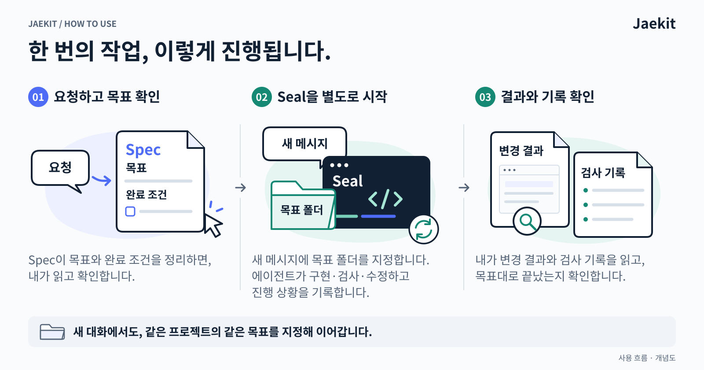

<h1 align="center">
  
</h1>

<p align="center">
  <a href="https://github.com/jgoneit/jaekit/releases"></a>
  <a href="guides/INSTALL.md"></a>
  <a href="LICENSE"></a>
</p>

<p align="center"><strong>한국어</strong> · <a href="README.en.md">English</a><br /><a href="#설치">설치</a> · <a href="#첫-작업-맡기기">첫 작업</a> · <a href="guides/USAGE.md">사용 안내</a></p>

Jaekit은 **Codex·Claude Code로 맡긴 프로젝트 작업의 목표와 확인 기록을 남기는 도구**입니다. **Spec**은 원하는 일과 완료 조건을 정리하고, **Seal**은 에이전트가 그 목표에 따라 작업을 이어 가고 확인 기록을 남기도록 합니다. 대화가 끊겨도 저장된 진행 상황에서 이어 갈 수 있습니다.

현재 배포판은 **v0.1.3**, 실제 작업에 써 보며 다듬는 초기 개발 단계입니다.

<details>
<summary>Jaekit 소개 이미지 보기</summary>


</details>

## 사용 흐름



Spec은 목표 문서를 작성한 뒤 **멈춥니다**. 내용을 확인하고 **별도 메시지로 Seal을 시작**하면 Codex·Claude Code의 에이전트가 구현·검사·수정을 진행합니다. 매 단계 승인할 필요는 없으며, 결과를 바꾸는 결정이나 직접 확인이 필요할 때 답합니다.

필수 완료 조건이 충족되면 완료 기록과 보고를 남깁니다. **무엇을 바꿨고 어떻게 검사했는지**, 실제 결과와 함께 확인하세요.

## 시작하기

### 설치

아래는 **macOS + Codex**로 시작하는 순서입니다. [Homebrew](https://brew.sh)(프로그램 설치 도구), Git, [Codex CLI](https://learn.chatgpt.com/docs/codex/cli), **Git으로 관리하는 작업할 프로젝트 폴더**가 필요합니다. Jaekit 저장소를 clone할 필요는 없습니다.

Claude Code는 [Claude Code 설치](guides/INSTALL.md#claude-code), Linux 또는 Homebrew 없는 환경은 [설치 안내](guides/INSTALL.md)를 따릅니다. Windows에서는 기록 도구 `ha`가 지원되지 않아 Seal을 쓸 수 없습니다. Spec은 `ha`가 필요 없지만 Windows의 설치·동작은 아직 확인하지 않았습니다.

**1. 터미널에서 기록 도구 `ha`를 설치합니다.** 아래 블록을 하나씩 실행하고 끝날 때까지 기다립니다.

```bash
brew install jgoneit/tap/jaekit
```

```bash
ha --version
```

`ha 0.1.3`가 나와야 합니다. 명령을 찾지 못하거나 버전이 다르면 [버전 확인](guides/INSTALL.md#버전-확인)을 봅니다.

**2. 같은 터미널에서 Codex 플러그인을 설치합니다.**

```bash
codex plugin marketplace add jgoneit/jaekit@v0.1.3
codex plugin add spec@jaekit
codex plugin add seal@jaekit
```

설치 후 **Codex를 새로 엽니다.** `@v0.1.3`는 사용할 배포판을 고정합니다. 이미 설치했다면 [업데이트](guides/INSTALL.md#업데이트) 또는 [기존 로컬 설치에서 전환](guides/INSTALL.md#로컬-경로-등록에서-옮기기)을 먼저 확인합니다.

### 첫 작업 맡기기

작업할 프로젝트 폴더에서 Codex CLI 또는 데스크톱 앱을 엽니다. **이제부터는 터미널이 아니라 에이전트 대화에 입력합니다.**

**1. Spec에 요청합니다.** `$`를 입력하고 목록에서 Jaekit의 `spec:spec`을 고른 뒤, 원하는 작업을 적습니다.

```text
$spec:spec 로그인 화면에 "비밀번호 찾기" 링크를 추가해줘
```

위 요청은 재설정 페이지가 이미 있는 프로젝트를 가정한 **가상 예시**이며, 실행하거나 검증을 마친 사례가 아닙니다. 실제 프로젝트에서 원하는 작업으로 바꿔 보내세요.

**2. 목표를 확인합니다.** Spec이 알려 준 문서를 읽고 수정할 내용을 말합니다. 이 예시라면 “새 링크가 기존 재설정 페이지로 연결되는지”, “기존 로그인이 그대로 동작하는지”가 완료 조건입니다.

**3. 별도 메시지로 Seal을 시작합니다.** `$` 목록에서 Jaekit의 `seal:seal`을 고르고 목표 폴더를 지정합니다.

```text
$seal:seal docs/specs/<goal>
```

`<goal>`은 **Spec이 알려 준 실제 목표 폴더 이름으로 바꾸는 자리**입니다. 이름이 `password-link`라면 전체 경로는 `docs/specs/password-link`입니다. Claude Code의 `/spec:spec`·`/seal:seal` 호출은 [사용 안내](guides/USAGE.md#명령-보내기)를 참고하세요.

### 대화가 끊겼다면

**같은 프로젝트 폴더에서 새 대화**를 열고 이전에 작업한 목표를 지정합니다. `<goal>`을 실제 폴더 이름으로 바꾸면 저장된 목표와 진행 기록에서 이어 갑니다.

```text
docs/specs/<goal> 이어서 해줘
```

## 쓰기 전에 알아두면 좋은 점

<details>
<summary><strong>완료 보고에서는 무엇을 확인하나요?</strong></summary>

필수 완료 조건은 검사 기록 또는 필요한 사용자 확인으로 충족돼야 합니다. 자동 검사는 에이전트가 작성하므로, 완료가 결과 전체의 무결함이나 독립된 제3자의 검증을 보장하지는 않습니다. 보고의 가정·남은 한계와 실제 결과를 함께 확인합니다.

기본 작업 결과는 로컬 변경과 commit(변경 이력 저장)까지입니다. GitHub에 올리거나 PR을 만들고 배포하는 일은 직접 하거나 일반 에이전트에 별도로 요청합니다. [완료 보고 읽기](guides/USAGE.md#완료-보고-읽기)

</details>

<details>
<summary><strong>목표만 정리해도 되나요?</strong></summary>

네. Spec은 Seal·`ha` 없이 사용할 수 있습니다. 목표를 정리해 두고 구현할 준비가 됐을 때 Seal을 시작하세요.

</details>

<details>
<summary><strong>어떤 기록이 남나요?</strong></summary>

프로젝트에 목표 문서, 작업 계획, 진행·완료 보고와 실행 기록이 남습니다. 진행 보고는 목표 폴더의 `PROGRESS.md`에서 볼 수 있습니다. 설치·업데이트·제거는 이 기록을 지우지 않습니다. Git 추적은 프로젝트 정책을 따르며, 공개 전에는 내용을 확인합니다. [저장되는 파일](guides/USAGE.md#저장되는-파일)

</details>

## 더 알아보기

- [설치·업데이트·제거](guides/INSTALL.md) · [배포판과 호환 범위](guides/INSTALL.md#배포판과-개발-조합)
- [사용 안내·목표 수정·재개](guides/USAGE.md) · [문제 해결](guides/USAGE.md#문제-해결)
- [자세한 운영 규칙](guides/OPERATIONS.md) · [명령·기록 형식](contracts/run-record.md)
- [이미지 설명과 수정 방법](assets/readme/SOURCES.md)

사용 경험이나 막힌 점은 [사용 보고·설치·버그 issue](https://github.com/jgoneit/jaekit/issues/new/choose)로 남겨 주세요. issue는 공개되므로 회사 코드, 내부 이름, 비밀 값과 로그 원문은 제외해 주세요.

[MIT 라이선스](LICENSE)
