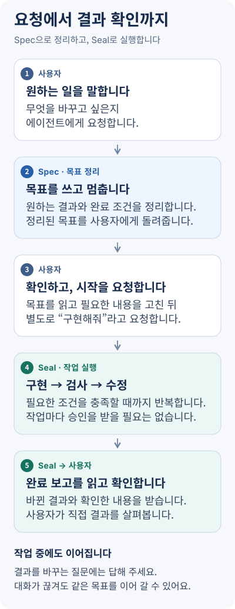
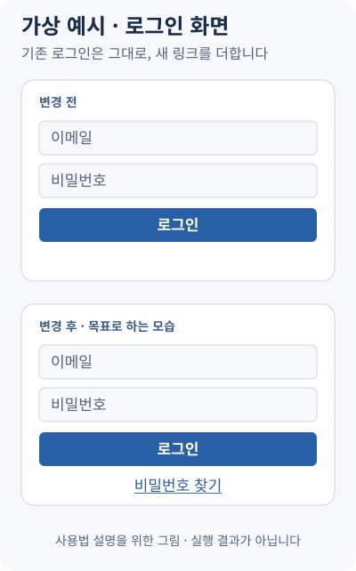

<h1 align="center">Jaekit</h1>

<p align="center"><strong>AI에게 맡긴 일, 무엇을 확인하고 끝냈는지 보세요.</strong></p>

<p align="center">
  <a href="https://github.com/jgoneit/jaekit/releases"></a>
  <a href="guides/INSTALL.md"></a>
  <a href="LICENSE"></a>
</p>

<p align="center"><a href="#설치">설치</a> · <a href="#가상-사용-예시">사용 예시</a> · <a href="guides/USAGE.md">사용 안내</a><br /><strong>한국어</strong> · <a href="README.en.md">English</a></p>

Jaekit은 **Codex·Claude Code로 프로젝트 작업을 하는 사람**을 위한 도구입니다. **Spec**은 요청을 목표와 완료 조건으로 정리합니다. **Seal**은 에이전트가 그 목표에 따라 구현·검사·수정을 이어 가도록 합니다. 결과와 확인 기록을 함께 받고, 대화가 끊겨도 저장된 진행 상황에서 이어 갈 수 있습니다.

현재 배포판은 **v0.1.3**, 실제 작업에 써 보며 다듬는 초기 개발 단계입니다.

이 페이지의 설치 명령은 v0.1.3(ha 0.1.3·spec 0.1.11·seal 0.1.9)을 받습니다. 새 목표는 `/3` 규칙을 사용하고, Seal은 실행할 Core의 지원 정보를 먼저 확인합니다. 기존 목표는 저장된 규칙을 유지합니다. [버전별 적용 범위](guides/INSTALL.md#배포판과-개발-조합)와 [참조 검사 사용법](guides/INSTALL.md#참조-검사-가져오기)을 확인하세요.

## 사용 흐름



Spec이 쓴 목표를 읽고 고칠 것이 있으면 말합니다. 준비되면 **별도의 시작 요청**으로 Seal에 맡깁니다. 매 작업마다 승인할 필요는 없으며, 결과를 바꾸는 결정이 필요할 때 답하면 됩니다. 대화가 끊겼다면 같은 목표를 지정해 이어 갑니다.

완료는 **필수 완료 조건을 검사 기록과 필요한 사용자 확인으로 충족했다는 뜻**입니다. 자동 검사는 에이전트가 작성하므로 결과 전체의 무결함이나 제3자의 보증을 뜻하지는 않습니다. 완료 보고와 실제 결과를 함께 확인합니다([완료 보고 읽기](guides/USAGE.md#완료-보고-읽기)).

## 가상 사용 예시

**요청 예시:** “로그인 화면에 비밀번호 찾기 링크를 추가해줘.” 비밀번호 재설정 페이지는 이미 있는 가상의 프로젝트를 생각해 봅니다.

Spec은 **새 링크가 기존 재설정 페이지로 연결되고, 로그인은 이전처럼 동작한다**는 목표를 정리한 뒤 멈춥니다. 내용을 확인하고 Seal을 따로 시작하면, 에이전트가 링크를 추가하고 이 두 조건을 검사합니다.



위 그림은 **사용법을 설명하기 위해 만든 가상 화면**입니다. 실행 결과나 검증을 마친 사례가 아닙니다. 실제 작업에서는 완료 보고의 조건별 검사 결과를 읽고, 링크와 로그인을 직접 확인합니다. [그림 설명과 수정 방법](assets/readme/SOURCES.md)

## 시작하기

### 설치

macOS에서 Codex로 시작하는 순서입니다. 먼저 [Homebrew](https://brew.sh)(프로그램 설치 도구), Git(파일 변경 이력 관리 도구), 터미널용 [Codex(Codex CLI)](https://learn.chatgpt.com/docs/codex/cli)가 필요합니다. 작업할 프로젝트도 Git으로 관리하는 폴더여야 합니다. 터미널은 명령을 입력해 프로그램을 실행하는 앱입니다.

Claude Code 사용자는 [Claude Code 설치](guides/INSTALL.md#claude-code)로, Linux 또는 Homebrew 없이 설치하려면 [설치 안내](guides/INSTALL.md)로 갑니다. Jaekit 저장소를 복사해 올 필요는 없습니다.

Windows에서는 기록 도구 `ha`(Seal Core)가 지원되지 않아 Seal을 쓸 수 없습니다. Spec은 `ha`가 필요 없지만, Windows에서의 설치와 동작은 아직 확인하지 않았습니다.

1. **터미널에서 기록 도구 `ha`를 설치합니다.** 블록을 하나씩 실행하고 끝날 때까지 기다립니다.

   ```bash
   brew install jgoneit/tap/jaekit
   ```

   설치가 끝나면 버전을 확인합니다.

   ```bash
   ha --version
   ```

   `ha 0.1.3`가 나와야 합니다. 다르게 나오거나 명령을 못 찾으면 [버전 확인](guides/INSTALL.md#버전-확인)을 봅니다.

2. **같은 터미널에서 Codex에 두 플러그인을 설치합니다.** 플러그인은 에이전트에 기능을 더하는 구성입니다.

   ```bash
   codex plugin marketplace add jgoneit/jaekit@v0.1.3
   codex plugin add spec@jaekit
   codex plugin add seal@jaekit
   ```

   `@v0.1.3`는 사용할 버전을 고정합니다. 설치가 끝나면 Codex를 새로 엽니다. 기존 설치가 있다면 [업데이트](guides/INSTALL.md#업데이트)나 [이전 로컬 설치에서 전환](guides/INSTALL.md#로컬-경로-등록에서-옮기기)을 먼저 봅니다.

### 첫 작업 맡기기

작업할 프로젝트 폴더에서 Codex CLI 또는 데스크톱 앱을 엽니다. **에이전트 대화에 `$`를 입력하고 목록에서 Jaekit의 `spec:spec`을 고른 뒤** 요청을 적습니다. 다음은 터미널 명령이 아닙니다.

```text
$spec:spec 로그인 화면에 "비밀번호 찾기" 링크를 추가해줘
```

Spec이 알려 준 목표 문서를 읽고, 질문에 답하거나 고칠 것을 말합니다. 그다음 별도의 메시지에서 `$` 목록의 Jaekit `seal:seal`을 골라 시작합니다. 아래 `<goal>`은 그대로 입력하는 글자가 아니라 **Spec이 알려 준 목표 폴더 이름**으로 바꿀 자리입니다.

```text
$seal:seal docs/specs/<goal>
```

[호출 방법과 이어 가기](guides/USAGE.md)에 Claude Code 명령과 두 도구의 재개 방법이 있습니다.

## 자세히 알아보기

- **쓰다가 막혔을 때:** [사용 안내와 문제 해결](guides/USAGE.md#문제-해결)
- **다른 환경이나 기존 설치:** [설치 안내](guides/INSTALL.md) · [업데이트](guides/INSTALL.md#업데이트) · [제거](guides/INSTALL.md#제거)
- **결과와 기록을 살펴볼 때:** [완료 보고·저장되는 파일](guides/USAGE.md#완료-보고-읽기) · [자세한 운영 규칙](guides/OPERATIONS.md)
- **명령과 기록 형식이 필요할 때:** [실행 기록 계약](contracts/run-record.md)
- **써 본 경험을 남길 때:** [사용 보고 또는 설치·버그 issue](https://github.com/jgoneit/jaekit/issues/new/choose)

issue는 공개됩니다. 맡긴 일과 결과, 막힌 점을 요약하고 회사 코드·내부 이름·비밀 값·로그 원문은 제외해 주세요.

[MIT 라이선스](LICENSE)
