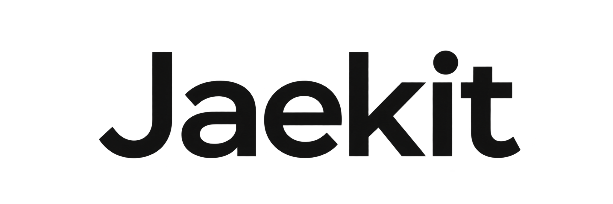

# README 이미지 안내

[English](SOURCES.en.md)

README에는 제공된 Jaekit 브랜드 이미지와 제품의 역할을 설명하는 개념도를 사용합니다.

## 브랜드 이미지

| 용도 | 미리보기 | 파일 |
| --- | --- | --- |
| 기본 로고 |  | [원본 PNG](brand/logo.png) · [표시용 SVG](brand/logo.svg) |
| 워드마크 |  | [원본 PNG](brand/wordmark.png) · [표시용 SVG](brand/wordmark.svg) |
| 작은 심볼 |  | [원본 PNG](brand/symbol.png) · [표시용 SVG](brand/symbol.svg) |

제공된 세 PNG 원본은 변경하지 않고 보관합니다. 표시용 SVG는 원본 PNG 바이트를 그대로 포함하고, 검은 로고가 다크 모드에서도 보이도록 둥근 흰색 바탕을 제공합니다. 원본 비율과 투명 여백을 유지합니다. README 상단에는 기본 로고를 사용하고, 나머지 형태는 이 안내에서 확인할 수 있습니다.

표시용 SVG는 [build_brand.py](source/build_brand.py)로 다시 만듭니다. Python 3 표준 라이브러리만 필요하며 저장소 루트에서 실행합니다. 이 명령은 PNG를 수정하지 않습니다.

```bash
python3 assets/readme/source/build_brand.py
```

## 개념도

대표 이미지와 사용 흐름은 Jaekit의 역할과 사용 순서를 설명하는 **개념도**입니다. 실제 화면, 실행 결과나 완료·검사 증명이 아닙니다. README의 비밀번호 찾기 요청도 사용법을 위한 가상 예시입니다.

| 이미지 | 한국어 | English |
| --- | --- | --- |
| 대표 이미지 | [hero.ko.png](hero.ko.png) | [hero.en.png](hero.en.png) |
| 사용 흐름 | [usage-flow.ko.png](usage-flow.ko.png) | [usage-flow.en.png](usage-flow.en.png) |
| 확대용 사용 흐름 | [usage-flow.ko.svg](usage-flow.ko.svg) | [usage-flow.en.svg](usage-flow.en.svg) |

README는 미리보기 호환성을 위해 PNG를 사용합니다. 그림의 뜻은 README 대체 텍스트와 본문으로도 읽을 수 있습니다.

## 개념도 출처와 수정

두 대표 이미지는 제공된 README 키트에서 가져왔습니다. 원본 제작 메모에는 OpenAI 이미지 생성으로 한국어판을 만들고 영어판으로 번역했다고 기록되어 있습니다. [이미지 프롬프트](source/IMAGE-PROMPTS.md)에 문구와 구성 지시를 보관합니다. PNG에는 편집 가능한 글자 레이어가 없으므로, 수정 후에는 두 언어의 문구와 가독성을 함께 확인합니다.

사용 흐름은 SVG로 작성했습니다. [사용 흐름 원본 안내](source/USAGE-FLOW.md)에 편집 가능한 텍스트 SVG, 생성 스크립트, 재생성 방법을 정리했습니다. 완성 SVG는 글자가 윤곽선으로 변환되어 폰트 설치가 필요하지 않습니다. 재생성 도구인 Python 3·fonttools와 Node.js·sharp는 **이미지를 수정할 때만** 필요하며, Jaekit 사용이나 기본 저장소 검사에는 필요하지 않습니다. 사용 폰트는 Noto Sans CJK KR이며 [SIL OFL 1.1 라이선스](source/FONT-LICENSE.txt)를 함께 보관합니다. 폰트 파일은 포함하지 않습니다.

## 수정할 때 유지할 뜻

- Spec은 목표와 완료 조건을 정리한 뒤 멈춥니다. 사용자가 목표를 확인하고 **별도 메시지로 Seal을 시작**합니다.
- 구현·검사·수정은 Codex·Claude Code의 에이전트가 수행합니다.
- 새 대화에서 이어 가려면 같은 프로젝트의 같은 목표를 지정합니다.
- 완료 보고는 변경과 확인 기록을 설명합니다. 통과하지 않은 검사를 통과한 것처럼 그리거나, 독립 검증·자동 배포를 약속하지 않습니다.
- 두 언어의 이미지와 대체 텍스트를 함께 갱신합니다.

제품 동작은 [사용 안내](../../guides/USAGE.md)를 따릅니다.
